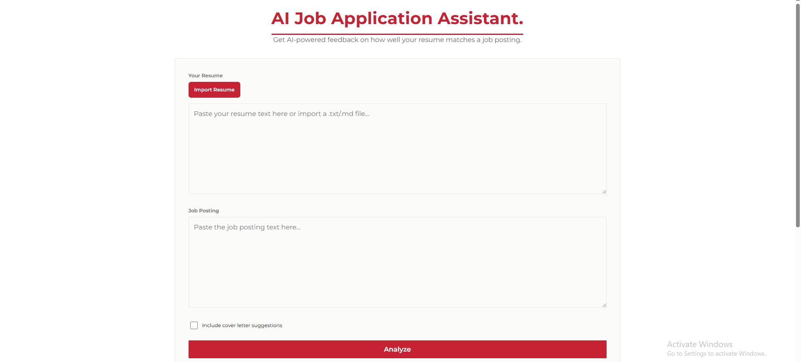
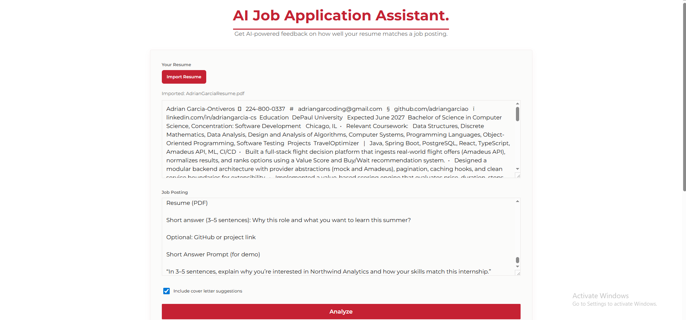
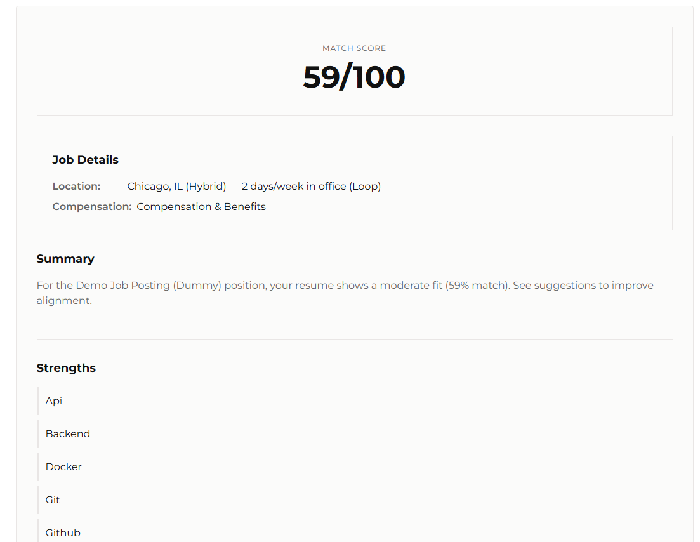
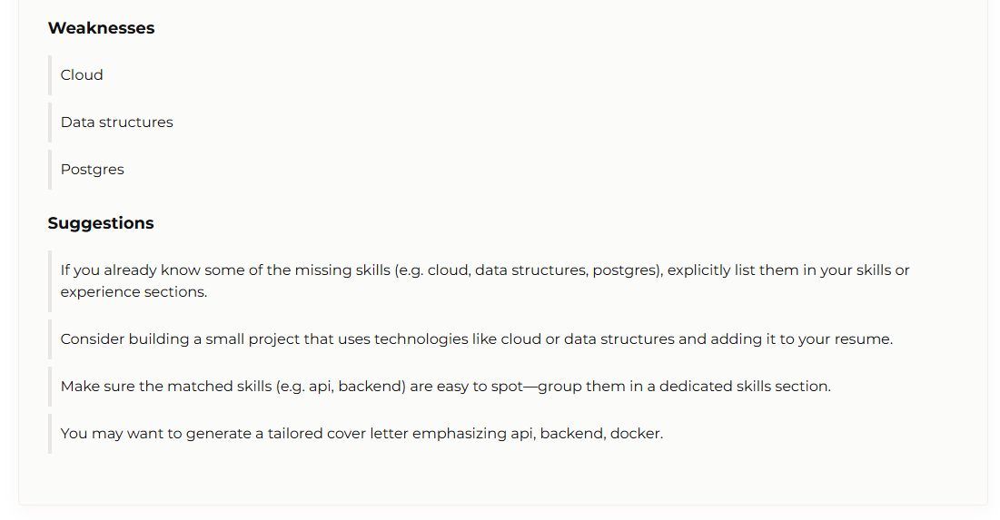

# AI Job Application Assistant


A full-stack Spring Boot application that helps job seekers analyze how well their resume matches job postings. Features intelligent parsing, AI-powered feedback, and job metadata extraction.

## Features

- **Resume Management**: Upload and store resumes with skill extraction
- **Job Application Tracking**: Track job applications with status management
- **AI-Powered Analysis**: 
  - Skill matching with required and nice-to-have skills
  - Match scoring (0-100 scale)
  - Strengths and weaknesses identification
  - Actionable suggestions for improvement
- **Job Metadata Extraction**:
  - Automatic location detection from job postings
  - Compensation/salary information extraction
- **Smart Skill Recognition**: 
  - Core technical skills detection
  - Context-aware matching (e.g., "golang" vs "go")
- **RESTful API**: Clean REST endpoints for all operations
- **React Frontend**: Modern UI for analyzing resumes against job postings

## Demo

The repository includes demo screenshots showcasing the frontend and analysis results. Images are located under `frontend/public/images`.

- **Frontpage**: the front landing page.

  

- **Frontpage (Filled Out)**: the front page with all parameters filled in.

  

- **Results (example 1)**: sample analysis results after running an analysis.

  

- **Results (example 2)**: another example of analysis output.

  

## Tech Stack

**Backend:**
- Java 21
- Spring Boot 3.5.6
- Spring Data JPA
- PostgreSQL
- Flyway (database migrations)
- JWT authentication
- MapStruct (object mapping)

**Frontend:**
- React 18
- Vite
- Modern CSS with gradients

## Getting Started

### Prerequisites

- Java 21 or higher
- PostgreSQL 17+ running locally on port 5432
- Maven 3.9+ (or use included Maven wrapper)
- Node.js 18+ (for frontend)

### Database Setup

Create a PostgreSQL database:
```sql
CREATE DATABASE jobassistant;
```

Configure database connection in `src/main/resources/application.properties` if needed.

### Running the Backend

```powershell
# Run tests
.\mvnw.cmd test

# Start the application
.\mvnw.cmd spring-boot:run
```

The backend will start on `http://localhost:8080`.

### Running the Frontend

```powershell
cd frontend
npm install
npm run dev
```

The frontend will start on `http://localhost:5173`.

### Running Tests

```powershell
# Run all tests
.\mvnw.cmd test

# Run specific test class
.\mvnw.cmd test -Dtest=FakeLLMServiceTest

# Run with coverage
.\mvnw.cmd clean test jacoco:report
```

**Test Coverage**: 100 tests, 100% passing

## API Endpoints

### AI Analysis
- `POST /api/ai/analyze` - Analyze resume against job posting

### Applications
- `GET /api/applications` - List all applications
- `POST /api/applications` - Create new application
- `GET /api/applications/{id}` - Get application by ID
- `PUT /api/applications/{id}` - Update application
- `DELETE /api/applications/{id}` - Delete application

### Resumes
- `GET /api/resumes` - List all resumes
- `POST /api/resumes` - Upload new resume
- `GET /api/resumes/{id}` - Get resume by ID
- `DELETE /api/resumes/{id}` - Delete resume

### Authentication
- `POST /api/auth/register` - Register new user
- `POST /api/auth/login` - Login
- `POST /api/auth/refresh` - Refresh access token

## Architecture

```
ai-job-app-assistant/
├── src/main/java/adriangarciao/ai_job_app_assistant/
│   ├── config/           # Security, CORS, AI configuration
│   ├── controller/       # REST controllers
│   ├── dto/              # Data transfer objects
│   ├── entity/           # JPA entities
│   ├── mapper/           # MapStruct mappers
│   ├── repository/       # Spring Data repositories
│   ├── security/         # JWT, authentication
│   └── service/          # Business logic
│       └── ai/           # AI analysis services
│           └── llm/      # LLM abstraction layer
├── src/main/resources/
│   └── db/migration/     # Flyway SQL migrations
├── src/test/             # Unit and integration tests
└── frontend/             # React frontend application
```

## AI Analysis System

The AI analysis system uses a deterministic skill-matching algorithm with:

- **70% weight**: Skill overlap (required + nice-to-have)
- **30% weight**: Text content overlap
- **Smart parsing**: Extracts skills, location, and compensation from job postings
- **Context-aware**: Understands technical terminology vs common words

### Skill Matching Algorithm

1. Extracts skills from resume and job posting
2. Identifies core technical skills (Java, Python, React, etc.)
3. Calculates match percentage for required and nice-to-have skills
4. Generates strengths, weaknesses, and suggestions
5. Extracts job metadata (location, compensation)

## Recent Updates

### v1.1.0 (Nov 2025)
- ✅ Fixed compensation extraction with 4-strategy approach
- ✅ Prevented "go" verb from being treated as Golang skill
- ✅ Added job location and compensation metadata to feedback
- ✅ Enhanced React UI to display job details
- ✅ All 100 tests passing

## Contributing

1. Fork the repository
2. Create a feature branch (`git checkout -b feature/amazing-feature`)
3. Commit your changes (`git commit -m 'feat: add amazing feature'`)
4. Push to the branch (`git push origin feature/amazing-feature`)
5. Open a Pull Request

CI automatically runs `mvn clean test` on all PRs to `main`.

## License

This project is for educational purposes.

## Contact

Adrian Garcia - [@adriangarciao](https://github.com/adriangarciao)
